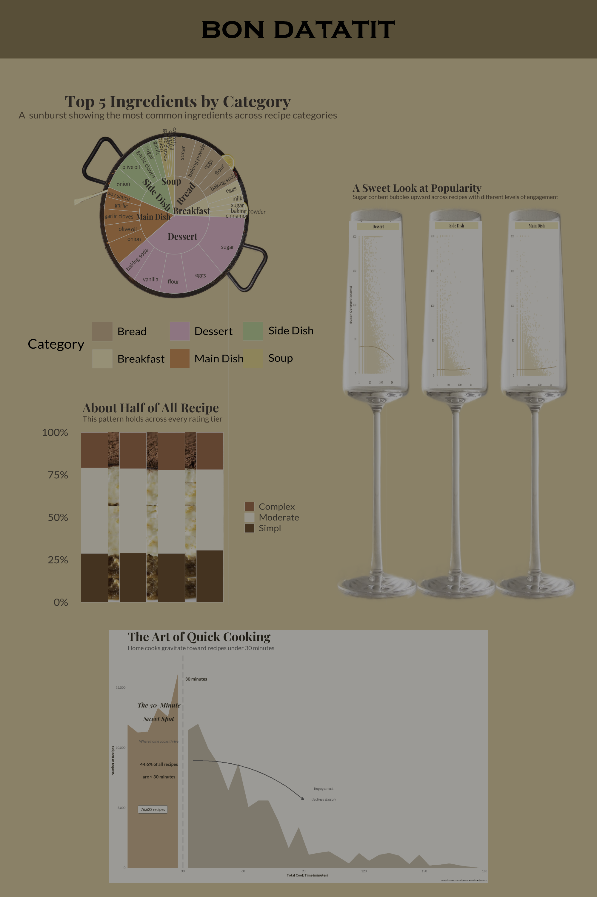

# What Makes a Recipe Popular? A Data‑Driven Look at How We Cook at Home

Why do some recipes take off while others barely get noticed? It’s a question every home cook, food blogger, and recipe platform has wondered about and one that feels surprisingly personal. We all have dishes we return to again and again, and others we scroll past without a second thought. But what actually drives that difference at scale?

To explore this, I turned to a massive dataset of more than 188,000 recipes published on Food.com between 1999 and 2016. With metadata on ingredients, cooking times, ratings, and nutritional information, the dataset offered an opportunity to examine the patterns behind recipe engagement.

My goal was to understand what makes a recipe resonate with home cooks.

I approached this through three guiding questions:

-   Time: Do quicker recipes attract more engagement?

-   Complexity: Are simpler dishes more popular, or do cooks reward effort?

-   Ingredients & Nutrition: What defines the “identity” of different recipe categories, and does nutrition influence popularity?

The result is the infographic below — a three‑course exploration of how we cook, what we choose, and why certain recipes rise to the top.

# Final Infographic



# Designing the Infographic

Creating this infographic was as much a design challenge as a data challenge. Below, I walk through the ten design elements that shaped my process and how each contributed to the final product.

## 1. Hierarchy & Visual Flow

I structured the infographic like a meal: a starter, a main dish, a side dish (*coming soon*), and a dessert.

This metaphor created a natural visual flow and helped me organize the story:

-   The 30‑minute plot opens the narrative with a clear, intuitive insight.

-   The complexity “layered cake” plot anchors the center.

-   The ingredient sunburst and sugar‑popularity scatterplot act as dishes that deepen the this data analysis.

Like a dinner menu, this structure guides the viewer through the thought process to the conclusion.

## 2. Color

I used a warm, food‑inspired palette — terracotta, caramel, cream, and sage — inspired by Bon Appétit and Sûr La Table. These tones:

-   evoke a culinary aesthetic

-   differentiate plot elements without overwhelming

-   maintain a general cohesion across all visualizations

The palette also reinforces the editorial tone I wanted.

## 3. Typography

I paired Playfair Display for titles with Lato for body text and annotations. This serif‑sans pairing is common in modern food media and creates a balance between elegance and readability.

## 4. Annotation

Annotations were essential for turning raw data into a narrative:

-   “30‑Minute Sweet Spot” label highlights the dramatic drop‑off in engagement.

-   A curved arrow emphasizes the decline after 30 minutes.

-   The complexity plot uses left‑aligned labels instead of a traditional x‑axis, creating a cleaner editorial look.

-   The sugar‑popularity plot includes intuitive log‑scale labels (“1”, “10”, “100”, “1k”, “10k”).

These annotations help the viewer understand the story without needing to decode the data.

## 5. Layout

I used generous spacing, centered titles, and consistent margins to maintain an airy, magazine‑style feel. Circular elements (like the sunburst (*and radial calorie plot*) balance the rectangular bar charts and scatterplots, creating visual variety without monotony.

## 6. Simplicity

Each visualization focuses on a single idea:

-   Time relates to engagement

-   Complexity relates to rating tiers

-   Ingredients relates to category identity

-   Sugar relates to popularity

I intentionally avoided overplotting and limited categories where necessary (top five ingredients per category, three main facets for the sugar plot).

## 7. Consistency

All plots share:

-   the general background tone (#F5EFE6 / #F7F2EB)

-   the same font system

-   similar annotation styling

-   a cohesive palette

This consistency makes the infographic feel unified rather than distracting or detracting from the other "dishes" so to speak.

## 8. Accessibility

I used:

-   high‑contrast text

-   clear labels

-   intuitive axis scales

-   non‑color cues (stacking order, spacing)

While the palette is not strictly colorblind‑optimized, contrast remains strong and readability is preserved.

## 9. Storytelling

Each visualization answers a sub‑question, but together they reveal a broader pattern:

-   Home cooks overwhelmingly prefer quick recipes.

-   Moderate complexity is the sweet spot across rating tiers.

-   Ingredient families define the identity of recipe categories.

-   Nutrition (like sugar) can play a category‑dependent role in popularity.

The narrative builds from practical (time) to structural (ingredients) to evaluative (ratings and nutrition).

## 10. Applying a DEI Lens

The dataset does not directly represent people or communities in a way that raises equity concerns, but I was mindful of how I categorized cuisines. Perhaps looking into national dishes can be a future analysis.

# Closing Thoughts

This project taught me how messy real‑world food data can be and how much care is required to clean, parse, and interpret it responsibly. From ISO 8601 time strings to inconsistent ingredient formatting, the preprocessing shaped what was possible in the final visualizations. Moreover, starting from over 500k observations to a more reliable and not as memory intensive 200k observations gave me a better look at how rich data can be through the right strainers, appliances and funnels we have in our kitchen of tools.

But the biggest takeaway is this: Popularity isn’t random. It reflects how people actually cook.

Home cooks gravitate toward quick, moderately complex dishes built from familiar ingredients. The patterns are surprisingly consistent across categories and years.

In the end, this infographic is both a data story and a culinary one. It gives us a look at the preferences and habits that shape how we cook and eat at home.

# Full Foldable Code

```{r}
#| code-fold: true
#| eval: false
#| echo: true

# Load Libaries
library(tidyverse)
library(janitor)
library(lubridate)
library(showtext)
library(plotly)

font_add_google("Playfair Display", "playfair")
font_add_google("Lato", "lato")
showtext_auto()

# Import and Clean Data

recipes_raw <- read_csv("data/recipes_reviews/recipes.csv") |>
  clean_names()

recipes_clean <- recipes_raw |>
  filter(
    !is.na(aggregated_rating),
    !is.na(review_count),
    review_count > 0,
    calories < 9000,
    !is.na(recipe_category)
  ) |>
  select(
    name, author_name, prep_time, cook_time, total_time, date_published,
    recipe_category, keywords, recipe_ingredient_quantities,
    recipe_ingredient_parts, aggregated_rating, review_count, calories,
    fat_content, saturated_fat_content, cholesterol_content,
    sodium_content, carbohydrate_content, fiber_content,
    sugar_content, protein_content, recipe_servings
  ) |>
  mutate(
    category_group = case_when(
      str_detect(tolower(recipe_category), "dessert|cookie|cake|pie|candy|ice cream|cheesecake|brownie|pudding|tart") ~ "Dessert",
      str_detect(tolower(recipe_category), "beverage|drink|smoothie|shake|punch|cocktail|margarita") ~ "Beverage",
      str_detect(tolower(recipe_category), "breakfast|brunch|oatmeal|pancake|waffle|eggs") ~ "Breakfast",
      str_detect(tolower(recipe_category), "chicken|beef|pork|lamb|seafood|fish|salmon|tuna|steak|turkey|meat|main dish|casserole|pot roast|meatloaf|meatball") ~ "Main Dish",
      str_detect(tolower(recipe_category), "side|vegetable|potato|rice|beans|salad|grain") ~ "Side Dish",
      str_detect(tolower(recipe_category), "snack|appetizer|dip|spread") ~ "Appetizer",
      str_detect(tolower(recipe_category), "soup|stew|chowder|gumbo") ~ "Soup",
      str_detect(tolower(recipe_category), "bread|biscuit|scone|muffin") ~ "Bread",
      str_detect(tolower(recipe_category), "mexican|asian|italian|greek|african|japanese|thai|spanish|german|indian|cuban|korean|vietnamese") ~ "Cuisine",
      TRUE ~ "Other"
    ),
    year_published = year(date_published),
    ingredient_count = str_count(recipe_ingredient_parts, ",") + 1
  ) |>
  filter(category_group != "Other")


# Parse ISO 8601 Time


parse_iso_time <- function(time_str) {
  if (is.na(time_str) || time_str == "" || time_str == "None") return(NA_real_)
  clean_str <- str_remove(time_str, "^PT")
  hours <- str_extract(clean_str, "\\d+(?=H)") |> as.numeric() |> replace_na(0)
  minutes <- str_extract(clean_str, "\\d+(?=M)") |> as.numeric() |> replace_na(0)
  seconds <- str_extract(clean_str, "\\d+(?=S)") |> as.numeric() |> replace_na(0)
  total <- hours * 60 + minutes + seconds / 60
  if (total == 0) return(NA_real_)
  return(total)
}

recipes_clean <- recipes_clean |>
  mutate(
    prep_minutes = map_dbl(prep_time, parse_iso_time),
    cook_minutes = map_dbl(cook_time, parse_iso_time),
    total_minutes = map_dbl(total_time, parse_iso_time),
    time_category = case_when(
      total_minutes <= 30 ~ "Quick (≤30 min)",
      total_minutes <= 60 ~ "Medium (31-60 min)",
      total_minutes <= 120 ~ "Long (1-2 hrs)",
      total_minutes > 120 ~ "Very Long (>2 hrs)",
      TRUE ~ NA_character_
    ),
    complexity = case_when(
      ingredient_count <= 5 ~ "Simple (≤5 ingredients)",
      ingredient_count <= 10 ~ "Moderate (6-10 ingredients)",
      ingredient_count > 10 ~ "Complex (>10 ingredients)",
      TRUE ~ NA_character_
    )
  )


# Fix Sugar Column

recipes_clean <- recipes_clean |>
  mutate(
    sugar_content = as.numeric(sugar_content)
  ) |>
  filter(
    sugar_content >= 0,
    sugar_content <= 500
  )


# Visualizations

# 1. 30-Minute Sweet Spot
#| eval: true
#| echo: false
#| warning: false
#| message: false
#| fig-width: 12
#| fig-height: 8


font_add_google("Playfair Display", "playfair")
font_add_google("Lato", "lato")
showtext_auto()

time_volume <- recipes_clean |>
  filter(!is.na(total_minutes), total_minutes < 180) |>
  mutate(time_bin = cut(total_minutes, breaks = seq(0, 180, 5))) |>
  count(time_bin) |>
  mutate(midpoint = as.numeric(str_extract(time_bin, "\\d+")) + 2.5)

under30 <- sum(time_volume$n[time_volume$midpoint <= 30])
total_recipes <- sum(time_volume$n)
pct_under30 <- round((under30 / total_recipes) * 100, 1)

ggplot(time_volume, aes(x = midpoint, y = n)) +
  geom_area(
    data = time_volume |> filter(midpoint <= 30),
    fill = "#C7956D", alpha = 0.85
  ) +
  geom_area(
    data = time_volume |> filter(midpoint > 30),
    fill = "#8B7355", alpha = 0.5
  ) +
  geom_vline(
    xintercept = 30,
    color = "#4A4A4A",
    linewidth = 1,
    linetype = "longdash",
    alpha = 0.4        # make the line lighter
  ) +

  # Update annotation position
  annotate(
    "text",
    x = 30, y = max(time_volume$n) * 0.97,
    label = "30 minutes",
    family = "lato",
    size = 7,
    fontface = "bold",
    color = "#2C2416",
    hjust = -0.1
  ) +

  # Annotations and styling
  annotate(
    "text", 
    x = 18, y = max(time_volume$n) * 0.80,
    label = "The 30-Minute\nSweet Spot",
    family = "playfair", 
    size = 10, 
    fontface = "bold.italic",
    color = "#2C2416",
    lineheight = 0.9
  ) +
  annotate(
    "text",
    x = 18, y = max(time_volume$n) * 0.65,
    label = "Where home cooks thrive",
    family = "lato",
    size = 6,
    color = "#5A5A5A",
    fontface = "italic"
  ) +
  annotate(
    "text",
    x = 18, y = max(time_volume$n) * 0.50,
    label = paste0(pct_under30, "% of all recipes\nare ≤ 30 minutes"),
    family = "lato",
    size = 7,
    color = "#2C2416",
    fontface = "bold"
  ) +
  annotate(
    "curve",
    x = 35, xend = 90,
    y = max(time_volume$n) * 0.55, yend = max(time_volume$n) * 0.35,
    arrow = arrow(length = unit(0.2, "cm"), type = "closed"),
    color = "#5A5A5A", 
    linewidth = 0.8,
    curvature = -0.2
  ) +
  annotate(
    "text",
    x = 100, y = max(time_volume$n) * 0.38,
    label = "Engagement\ndeclines sharply",
    family = "lato",
    size = 6,
    color = "#5A5A5A",
    fontface = "italic"
  ) +
  annotate(
    "label",
    x = 15, y = max(time_volume$n) * 0.30,
    label = paste0(scales::comma(sum(time_volume$n[time_volume$midpoint <= 30])), 
                   " recipes"),
    family = "lato",
    size = 6,
    color = "#2C2416",
    fill = "#F5EFE6",
    label.padding = unit(0.3, "lines")
  ) +

  scale_y_continuous(
    labels = scales::comma,
    expand = expansion(mult = c(0, 0.1))
  ) +
  scale_x_continuous(
    breaks = seq(0, 180, 30),
    expand = expansion(mult = c(0, 0.02))
  ) +

  labs(
    title = "The Art of Quick Cooking",
    subtitle = "Home cooks gravitate toward recipes under 30 minutes",
    x = "Total Cook Time (minutes)",
    y = "Number of Recipes",
    caption = "Analysis of 188,000 recipes from Food.com | © 2026"
  ) +

  theme_minimal(base_family = "lato") +
  theme(
    plot.background = element_rect(fill = "#F5EFE6", color = NA),
    panel.background = element_rect(fill = "#F5EFE6", color = NA),

    # remove girdlines
    panel.grid = element_blank(),

    plot.title = element_text(
      family = "playfair",
      size = 55,
      face = "bold",
      color = "#2C2416"
    ),
    plot.subtitle = element_text(
      family = "lato",
      size = 28,
      color = "#5A5A5A"
    ),
    axis.text = element_text(color = "#5A5A5A", size = 14),
    axis.title = element_text(color = "#2C2416", size = 16, face = "bold")
  )
######################################################
# 2. Complexity by Rating Tier

font_add_google("Playfair Display", "playfair")
font_add_google("Lato", "lato")
showtext_auto()

# Data prep for rating plot
df <- recipes_clean |>
  mutate(
    rating_cat = case_when(
      aggregated_rating >= 4.5 ~ "Excellent",
      aggregated_rating >= 4.0 ~ "Very Good",
      aggregated_rating >= 3.5 ~ "Good",
      TRUE ~ "Below Average"
    ),
    complexity_cat = case_when(
      ingredient_count <= 5 ~ "Simple",
      ingredient_count <= 10 ~ "Moderate",
      TRUE ~ "Complex"
    ),
    rating_cat = factor(
      rating_cat,
      levels = c("Below Average", "Good", "Very Good", "Excellent")
    )
  ) |>
  count(rating_cat, complexity_cat) |>
  group_by(rating_cat) |>
  mutate(prop = n / sum(n)) |>
  ungroup()

cake_palette <- c(
  "Simple"   = "#6D401F",
  "Moderate" = "#EDE2CC",
  "Complex"  = "#A5583A"
)

# Base plot
p <- ggplot(df, aes(x = rating_cat, y = prop, fill = complexity_cat)) +
  geom_col(
    color = "white",
    linewidth = 1,
    width = 0.7   # add spacing between bars
  ) +
  scale_y_continuous(labels = scales::percent_format()) +
  scale_fill_manual(values = cake_palette) +
  labs(
    title = "About Half of All Recipes Are Moderately Complex",
    subtitle = "This pattern holds across every rating tier",
    x = NULL,
    y = NULL,
    fill = NULL
  ) +
  theme_minimal(base_family = "lato") +
  theme(
    plot.background = element_rect(fill = "#F7F2EB", color = NA),
    panel.grid = element_blank(),
    plot.title = element_text(
      family = "playfair",
      size = 32,
      face = "bold",
      color = "#3A2E2A"
    ),
    plot.subtitle = element_text(
      family = "lato",
      size = 20,
      color = "#5A4634"
    ),
    axis.text.x = element_blank(),   # remove x-axis labels
    axis.text.y = element_text(
      family = "lato",
      size = 16,
      color = "#4A3F35"
    ),
    legend.text = element_text(
      family = "lato",
      size = 14,
      color = "#4A3F35"
    ),
    plot.margin = margin(20, 20, 20, 20)
  )

# Add left-side labels for each bar
# Convert factor positions to numeric for annotations
rating_positions <- as.numeric(levels(df$rating_cat))

p +
  annotate(
    "text",
    x = rating_positions - 0.55,   # Shift labels left of bars
    y = 0.5,                       # Vertically centered
    label = levels(df$rating_cat),
    family = "lato",
    size = 6,
    hjust = 1,
    color = "#4A3F35"
  )
##########################################################
# 3. Radial Calories Over Time

font_add_google("Playfair Display", "playfair")
font_add_google("Lato", "lato")
showtext_auto()

cal_time <- recipes_clean |>
  filter(calories > 0, calories < 8000) |>
  group_by(year_published) |>
  summarise(median_cal = median(calories, na.rm = TRUE)) |>
  filter(!is.na(year_published))

ggplot(cal_time, aes(
  x = factor(year_published),
  y = median_cal,
  fill = median_cal
)) +
  geom_col(width = 1, color = "white") +
  coord_polar() +
  scale_fill_gradient(low = "#E9C46A", high = "#C14953") +
  labs(
    title = "Calories Over Time",
    subtitle = "Median calories per year tend to be between 300 - 350 calories per serving.",
    x = NULL, y = NULL, fill = "Median Calories"
  ) +
  theme_void(base_family = "lato") +
  theme(
    plot.background = element_rect(fill = "#F5EFE6", color = NA),
    plot.title = element_text(
      family = "playfair",
      size = 26,
      face = "bold",
      hjust = 0.5
    ),
    plot.subtitle = element_text(
      family = "lato",
      size = 12,
      hjust = 0.5
    ),
    legend.position = "bottom"
  ) +
  annotate(
    "text",
    x = "2018",
    y = max(cal_time$median_cal) * 1.25,
    label = "Median calories peak in 2018–2019,\nthough late-year values include fewer recipes.",
    family = "lato",
    size = 3.5,
    color = "#5A5A5A",
    hjust = 0.5
  )
#####################################################################

# 4. Sugar vs Popularity Faceted Scatterplot
#| eval: true
#| echo: false
#| warning: false
#| message: false
#| fig-width: 12
#| fig-height: 10

font_add_google("Playfair Display", "playfair")
font_add_google("Lato", "lato")
showtext_auto()

# Use all recipes with at least 1 review, facet only the 3 main categories
nutri_df <- recipes_clean |>
  filter(
    category_group %in% c("Dessert", "Main Dish", "Side Dish"),
    sugar_content > 0,
    review_count >= 1
  ) |>
  mutate(
    review_log = log10(review_count),      # log10(1) = 0 so clean axis start
    sugar_trim = pmin(sugar_content, 200)  # trim extreme outliers for readability
  )

ggplot(nutri_df, aes(x = review_log, y = sugar_trim)) +
  geom_point(
    alpha = 0.56,
    color = "#E8CFA9",   # gold for champagne color 
    size = 2
  ) +
  geom_smooth(
    method = "loess",
    se = FALSE,
    color = "#C49A6C",
    linewidth = 1.2
  ) +
  facet_wrap(~ category_group, scales = "free_y") +
  scale_x_continuous(
    breaks = c(0, 1, 2, 3, 4),
    labels = c("1", "10", "100", "1k", "10k")
  ) +
  labs(
    title = "A Sweet Look at Popularity",
    subtitle = "Sugar content bubbles upward across recipes with different levels of engagement",
    x = "Popularity (review count, log scale)",
    y = "Sugar Content (grams)"
  ) +
  theme_minimal(base_family = "lato") +
  theme(
    plot.background = element_rect(fill = "#F5EFE6", color = NA),
    panel.grid = element_blank(),
    strip.background = element_rect(fill = "#F2D7A0", color = NA),
    strip.text = element_text(
      family = "playfair",
      size = 18,
      face = "bold",
      color = "#3A2E2A"
    ),
    plot.title = element_text(
      family = "playfair",
      size = 32,
      face = "bold",
      color = "#3A2E2A"
    ),
    plot.subtitle = element_text(
      family = "lato",
      size = 18,
      color = "#5A4634"
    ),
    axis.title = element_text(
      family = "lato",
      size = 14,
      face = "bold",
      color = "#4A3F35"
    ),
    axis.text = element_text(
      family = "lato",
      size = 12,
      color = "#4A3F35"
    ),
    plot.margin = margin(20, 20, 20, 20)
  )
############################################################

# 5. Ingredient Sunburst
#| echo: false
#| warning: false
#| message: false

# Extract top 5 ingredients per category (static version for ggplot sunburst)
top_ing5 <- recipes_clean |>
  filter(
    !is.na(category_group),
    category_group %in% c("Main Dish", "Dessert", "Side Dish", "Soup", "Breakfast", "Bread"),
    !is.na(recipe_ingredient_parts)
  ) |>
  mutate(
    ingredients_clean = str_remove_all(recipe_ingredient_parts, '^c\\(|\\)$'),
    ingredients_clean = str_remove_all(ingredients_clean, '\\"')
  ) |>
  separate_rows(ingredients_clean, sep = ", ") |>
  mutate(
    ingredient = str_trim(str_to_lower(ingredients_clean))
  ) |>
  filter(
    ingredient != "",
    !ingredient %in% c("salt", "pepper", "water", "oil", "butter")
  ) |>
  count(category_group, ingredient, sort = TRUE) |>
  group_by(category_group) |>
  slice_max(n, n = 5, with_ties = FALSE) |>
  ungroup()

font_add_google("Playfair Display", "playfair")
font_add_google("Lato", "lato")
showtext_auto()

# Prepare data
sunburst_df <- top_ing5 |>
  mutate(
    category_group = factor(category_group),
    ingredient = factor(ingredient)
  )

# Compute cumulative positions for each category
cat_positions <- sunburst_df |>
  group_by(category_group) |>
  summarise(total = sum(n)) |>
  mutate(
    cat_start = lag(cumsum(total), default = 0),
    cat_end = cumsum(total),
    cat_mid = (cat_start + cat_end) / 2
  )

# Merge category positions back into ingredient data
sunburst_df <- sunburst_df |>
  left_join(cat_positions, by = "category_group") |>
  group_by(category_group) |>
  mutate(
    ing_start = cat_start + cumsum(lag(n, default = 0)),
    ing_end = ing_start + n,
    ing_mid = (ing_start + ing_end) / 2
  ) |>
  ungroup()

# Inner ring (categories)
inner <- cat_positions |>
  mutate(
    xmin = cat_start,
    xmax = cat_end,
    ymin = 0,
    ymax = 1,
    label = category_group
  )

# Outer ring (ingredients)
outer <- sunburst_df |>
  mutate(
    xmin = ing_start,
    xmax = ing_end,
    ymin = 1,
    ymax = 2,
    label = ingredient
  )

# Combine for plotting
sunburst_plot_df <- bind_rows(
  inner |> mutate(type = "category"),
  outer |> mutate(type = "ingredient")
)

# Plot
ggplot() +
  # Category ring
  geom_rect(
    data = inner,
    aes(xmin = xmin, xmax = xmax, ymin = ymin, ymax = ymax, fill = label),
    color = "#F5EFE6",
    linewidth = 0.6
  ) +
  # Ingredient ring
  geom_rect(
    data = outer,
    aes(xmin = xmin, xmax = xmax, ymin = ymin, ymax = ymax, fill = category_group),
    color = "#F5EFE6",
    linewidth = 0.4
  ) +
  # Category labels
  geom_text(
    data = inner,
    aes(x = cat_mid, y = 0.5, label = label),
    family = "playfair",
    size = 5,
    color = "#3A2E2A",
    fontface = "bold",
    angle = 0
  ) +
  # Ingredient labels (need to fix)
  geom_text(
    data = outer,
    aes(x = ing_mid, y = 1.5, label = label, angle = (ing_mid / max(outer$ing_end)) * 360),
    family = "lato",
    size = 3.2,
    color = "#4A3F35",
    hjust = 0
  ) +
  coord_polar(theta = "x") +
  scale_fill_manual(values = c(
  "Main Dish" = "#D97A40",
  "Dessert"   = "#E8A6C1",
  "Side Dish" = "#A3C586",
  "Soup"      = "#E2C275",
  "Breakfast" = "#F2D8A7",
  "Bread"     = "#C9A27E"
)) +
  labs(
    title = "Top 5 Ingredients by Category",
    subtitle = "A  sunburst showing the most common ingredients across recipe categories",
    fill = "Category"
  ) +
  theme_void(base_family = "lato") +
  theme(
    plot.background = element_rect(fill = "#F5EFE6", color = NA),
    legend.position = "bottom",
    plot.title = element_text(
      family = "playfair",
      size = 30,
      face = "bold",
      color = "#3A2E2A",
      hjust = 0.5
    ),
    plot.subtitle = element_text(
      family = "lato",
      size = 18,
      color = "#5A4634",
      hjust = 0.5
    )
  )


# End of Code

```
